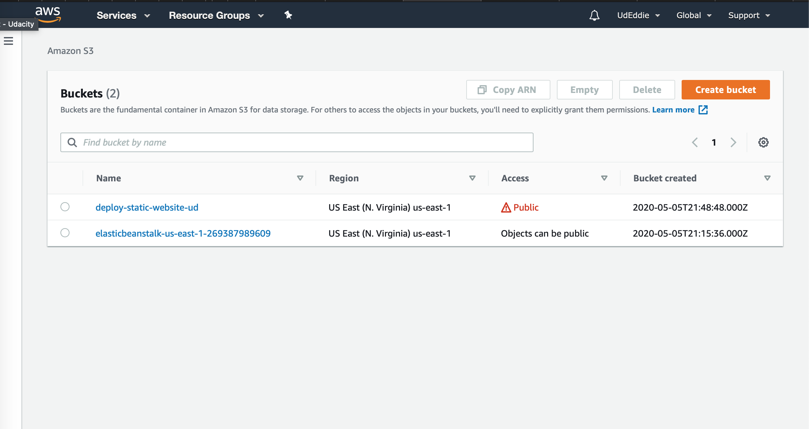
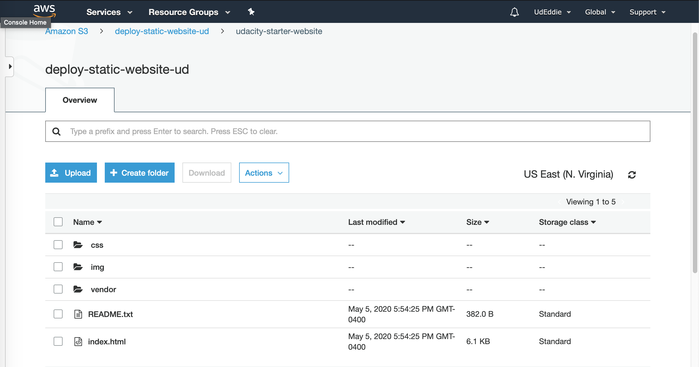
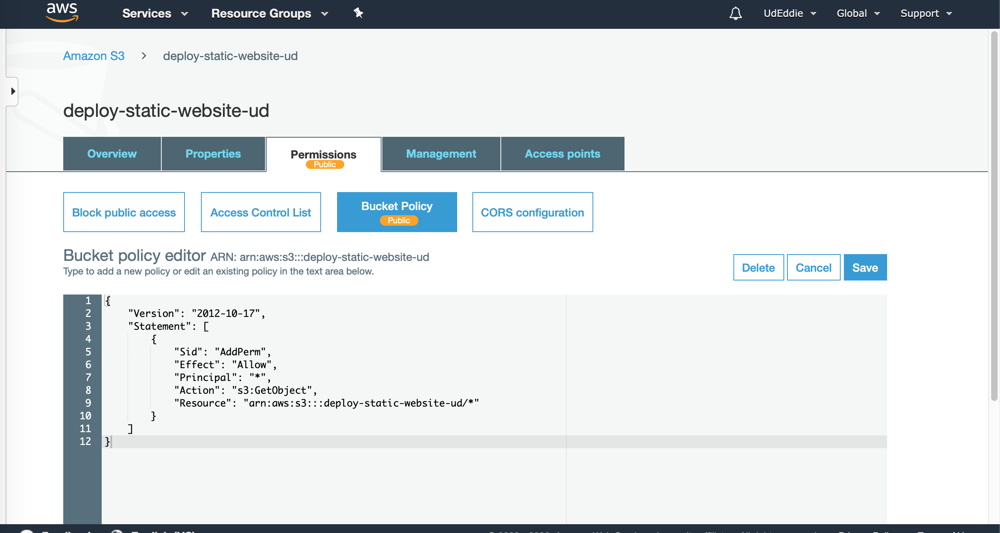
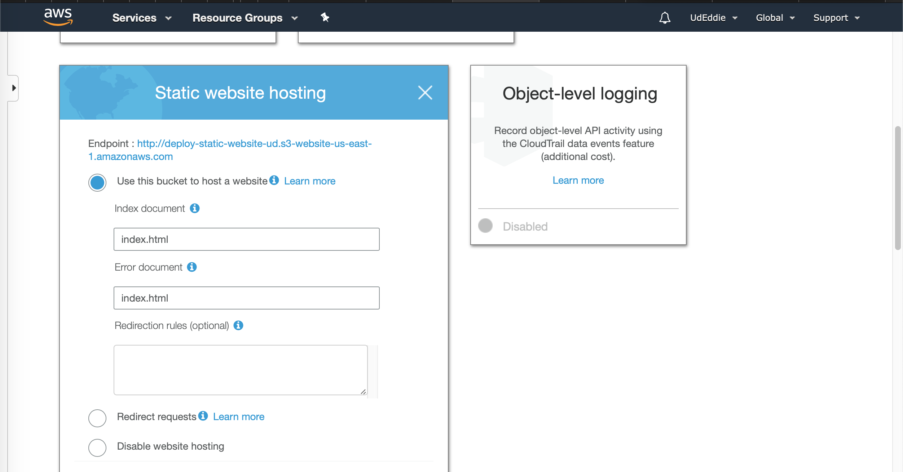

# Udacity Cloud Devloper Nandogree

___

## Project 1: Deploy Static Website on AWS

___

This project required me to apply my knowledge of Amazon Web Service (AWS) to deploy a static webstite to AWS CDN service, CloudFront.

### Step 1: Create a S3 Bucket

### Step 2: Upload files to S3 Bucket

### Step 3: Secure the Bucket via IAM

### Step 4: Configure S3 Bucket

### Step 5: Distribute Website via CloudFront

### Step 6: Access the Website in a Web Browser

[Access URL link Click here!](http://d1lt8mrf8to8ld.cloudfront.net/index.html)

